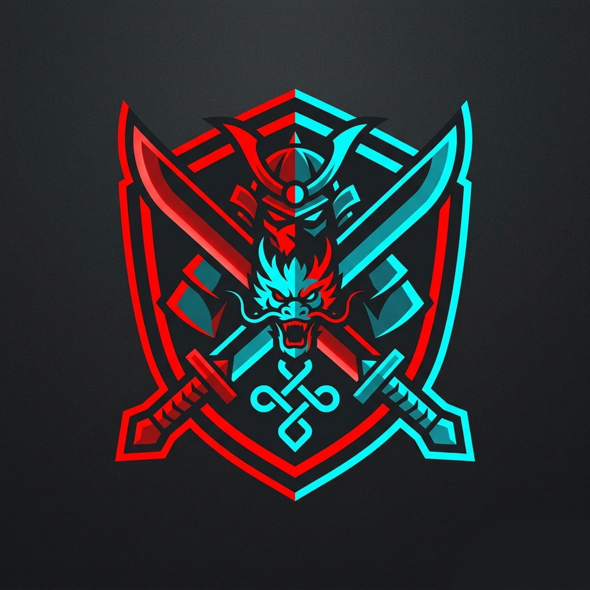

<p align="center">
  
</p>

<h1 align="center">⚔️ 劫招社 JieAcademy ⚔️</h1>

<p align="center"><strong>面向《永劫无间》玩家的开源硬核教学社区</strong></p>
<p align="center">收录武器与英雄教学内容、用户鉴权与投稿系统、管理后台等功能。</p>

<p align="center">
  
  
  
  
  
</p>

<p align="center">
  
  
  
  
</p>

---

<details open>
<summary><b>📖 目录 (Table of Contents)</b></summary>

- [⚠️ 重要声明](#-重要声明)
- [✨ 项目特点](#-项目特点)
- [🛠️ 环境要求](#️-环境要求)
- [🚀 快速开始](#-快速开始)
  - [1. 后端启动](#1-后端启动)
  - [2. 前端启动](#2-前端启动)
- [📁 项目结构](#-项目结构)
- [🔌 主要接口](#-主要接口)
- [📦 部署说明](#-部署说明)
- [🤝 贡献指南](#-贡献指南)

</details>

---

## ⚠️ 重要声明

> **劫招社 (JieAcademy) 仅用于《永劫无间》游戏技巧交流、前后端技术学习与个人技术研究。**
> 本项目为非盈利性质的开源项目，不提供任何游戏代练、外挂或破坏游戏公平性的工具。

---

## ✨ 项目特点

| 功能模块 | 详情说明 |
|:---:|---|
| 🎮 **硬核教学** | 提供武器、英雄连招演示及实战教学内容的前端展示页面，快速提升玩家技巧。 |
| 🛡️ **安全鉴权** | 支持用户注册、登录，并基于 `JWT (JSON Web Token)` 提供安全的接口鉴权机制。 |
| ✍️ **社区投稿** | 允许用户自主投稿教学内容，汇聚社区力量共建最强兵器谱，并配备管理后台进行审核。 |
| ⚡ **现代架构** | 后端使用 `Django REST Framework` 提供稳定接口，前端基于 `Vue 3 + Vite` 打造极致的交互体验。 |

## 🛠️ 环境要求

确保在运行项目前，您的本地环境满足以下最低版本要求：

- **Python**: `3.10+`
- **Node.js**: `18+`
- **包管理器**: `npm 9+`

## 🚀 快速开始

本项目采用**前后端分离**的开发模式，请分别在两个终端中启动前端和后端服务。

### 1. 后端启动

```bash
# 进入后端目录
cd backend

# 创建虚拟环境
python -m venv .venv

# 激活虚拟环境 (Windows)
.\.venv\Scripts\Activate.ps1
# 激活虚拟环境 (Linux / macOS)
source .venv/bin/activate

# 安装依赖项
pip install -r requirements.txt

# 执行数据库迁移并创建超级管理员
python manage.py migrate
python manage.py createsuperuser

# 启动开发服务器
python manage.py runserver 0.0.0.0:8000
```

> **🎉 后端服务已启动！**
> - API 接口：http://localhost:8000
> - 管理后台：http://localhost:8000/admin/

### 2. 前端启动

```bash
# 进入前端目录
cd frontend

# 安装依赖
npm install

# 启动开发服务器
npm run dev
```

> **🎉 前端页面已启动！**
> - 访问地址：http://localhost:3000 (具体端口请参考终端输出)
> 
> *注：前端开发服务器已配置代理，默认会将 `/api` 前缀的请求自动转发至后端 `http://127.0.0.1:8000`。*

## 📁 项目结构

```text
JieAcademy/
├── backend/              # 🐍 Django 后端代码
│   ├── apps/             # 业务应用 (用户 auth、教程 tutorial 等)
│   ├── naraka/           # 核心配置与路由
│   └── templates/        # 定制化 Admin 模板
├── frontend/             # ⚡ Vue 3 前端代码
│   ├── src/              # 页面 (views)、组件 (components)、状态 (store)
│   └── public/           # 静态资源 (图片、字体)
├── docs/                 # 📚 开发文档与素材
└── README.md             # 📝 项目说明文档
```

## 🔌 主要接口 (API Reference)

| HTTP 方法 | 接口路径 | 模块说明 |
|:---:|:---|:---|
| `POST` | `/api/auth/register/` | 用户注册 |
| `POST` | `/api/auth/login/` | 用户登录 (获取 Token) |
| `POST` | `/api/auth/refresh/` | 刷新 Token |
| `GET`  | `/api/auth/profile/` | 获取当前用户信息 |
| `GET`  | `/api/contributions/` | 获取所有用户投稿列表 |
| `POST` | `/api/contributions/` | 提交新的用户投稿 |
| `GET`  | `/admin/` | Django 原生管理后台 |
| `GET`  | `/api/admin/dashboard/` | 自定义数据仪表盘接口 |

## 📦 部署说明

如需将本项目部署至生产环境，请参考以下建议：

1. **数据库切换**：生产环境建议将默认的 `SQLite` 替换为 `MySQL`。可以在 [backend/naraka/settings.py](backend/naraka/settings.py) 中修改 `DATABASES` 配置。
2. **前端构建**：在 `frontend` 目录下执行 `npm run build`，生成的 `dist` 目录可交由 `Nginx` 等 Web 服务器托管。
3. **后端部署**：建议使用 `Gunicorn + Nginx` 部署 Django 服务。上线前请务必执行 `python manage.py collectstatic` 收集静态资源。

## 🤝 贡献指南

我们非常欢迎各位大佬提交 Pull Request 或是报告 Issue！
在参与开发之前，建议您先阅读 [docs/开发文档.md](docs/开发文档.md)，以快速了解项目的目录结构与核心实现思路。